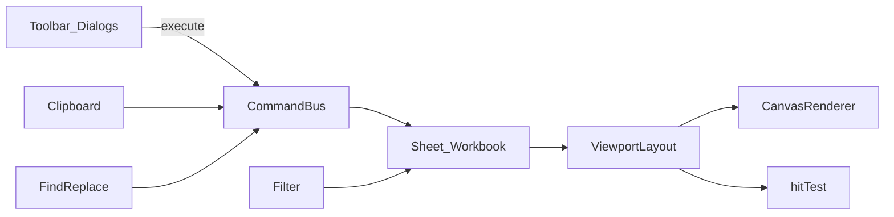

# 可用版 Phase 1 Implementation Plan

> **For agentic workers:** REQUIRED SUB-SKILL: Use superpowers:subagent-driven-development (recommended) or superpowers:executing-plans to implement this plan task-by-task. Steps use checkbox (`- [ ]`) syntax for tracking.

**Goal:** 在 MVP 之上补齐日常编辑刚需：合并/行列、复制粘贴与填充柄、冻结窗格、查找替换与筛选。

**Architecture:** 全部改动以 `Command` 进入 `CommandBus`（可 undo），模型仍在 `@luckysheet3/core`；Vue 只增加工具栏按钮与对话框。冻结与筛选改变「可见布局」，绘制与 hit-test 统一走 `layout` 辅助层，禁止在 Vue 里算坐标。

**Tech Stack:** 现有 pnpm monorepo · `@luckysheet3/core` · `@luckysheet3/vue` · Vitest · Canvas 2D

## Global Constraints

- `packages/core` 禁止 `import vue`
- 单元格不得 `reactive()`；chrome 继续 `shallowRef`
- 公式禁止 `eval` / `new Function`
- 合并编辑、筛选隐藏行必须可 undo
- Lucky JSON：`config.merge` / `rowlen` / `columnlen` / `frozen`（若有）尽量读写兼容；未知字段进 `extras`
- 不做：透视、图表、xlsx、协同 WebSocket、完整 109 API

## 文件结构（新增/主要修改）

```
packages/core/src/
  command/types.ts          # 扩展 Command 联合类型
  command/bus.ts            # 实现新命令 + inverse
  model/sheet.ts            # merge CRUD、行列移位、hiddenRows、row/col size
  model/workbook.ts         # clipboard、freeze、filter 状态与事件
  layout/viewport.ts        # 统一：offsets / freeze / hidden rows → 绘制与 hit
  clipboard/clipboard.ts    # 选区序列化 / 粘贴 / 填充序列
  find/find-replace.ts      # 查找替换
  filter/filter.ts          # 简单列筛选（隐藏行）
  render/canvas-renderer.ts # 冻结线、隐藏行、填充柄小方块
  hit/location.ts           # 支持冻结与隐藏行的 hit-test
  engine.ts                 # 对外 API 封装
packages/vue/src/components/
  Toolbar.vue               # Merge / 行列 / Freeze / Find / Filter 入口
  FindReplaceDialog.vue     # 查找替换对话框
  FilterMenu.vue            # 列筛选菜单（点击列头漏斗）
  GridCanvas.vue            # 填充柄拖拽、列头/行头 resize
packages/core/tests/
  merge-rows.spec.ts
  clipboard.spec.ts
  freeze.spec.ts
  find-filter.spec.ts
```



---

### Task 1: 合并 / 取消合并 + 行列增删与调宽高

**Files:**
- Modify: `packages/core/src/command/types.ts`
- Modify: `packages/core/src/command/bus.ts`
- Modify: `packages/core/src/model/sheet.ts`
- Modify: `packages/core/src/engine.ts`
- Modify: `packages/vue/src/components/Toolbar.vue`
- Modify: `packages/vue/src/components/GridCanvas.vue`
- Test: `packages/core/tests/merge-rows.spec.ts`

**Interfaces:**
- Produces commands:
  - `mergeCells { row, col, rowCount, colCount }`
  - `unmergeCells { row, col }`（以含该格的 merge 为准）
  - `insertRows { index, count }` / `deleteRows { index, count }`
  - `insertCols { index, count }` / `deleteCols { index, count }`
  - `setRowHeight { row, height }` / `setColWidth { col, width }`
- Sheet helpers: `setMerge`, `removeMergeAt`, `shiftRows`, `shiftCols`

- [ ] **Step 1: 写失败测试**（merge + insertRows 移位 celldata）

```ts
it("merges selection and unmerges", () => {
  const eng = new WorkbookEngine();
  eng.execute({ type: "setCellValue", row: 0, col: 0, value: "A" });
  eng.execute({ type: "mergeCells", row: 0, col: 0, rowCount: 2, colCount: 2 });
  expect(eng.workbook.getActiveSheet().getMergeAt(1, 1)).toMatchObject({ r: 0, c: 0, rs: 2, cs: 2 });
  eng.execute({ type: "unmergeCells", row: 1, col: 1 });
  expect(eng.workbook.getActiveSheet().getMergeAt(1, 1)).toBeNull();
});

it("insertRows shifts cells down", () => {
  const eng = new WorkbookEngine();
  eng.execute({ type: "setCellValue", row: 2, col: 0, value: 9 });
  eng.execute({ type: "insertRows", index: 1, count: 2 });
  expect(eng.getCellValue(4, 0)).toBe(9);
  expect(eng.getCellValue(2, 0)).toBeNull();
});
```

- [ ] **Step 2: 跑测确认失败** — `pnpm --filter @luckysheet3/core test -- merge-rows`
- [ ] **Step 3: 实现 Sheet.merge / shift + CommandBus 分支 + Toolbar 按钮**
- [ ] **Step 4: GridCanvas 行头/列头边缘拖拽调宽高**（阈值 4px，mousemove 时 `setRowHeight`/`setColWidth`）
- [ ] **Step 5: 测试通过后提交**

```bash
git add packages/core packages/vue
git commit -m "feat: 支持合并单元格与行列增删调宽高"
```

**验收:** 选区合并后绘制为一格；Undo 恢复；插入行后公式依赖重算（调用 `formula.recalculateAll`）。

---

### Task 2: 复制粘贴 + 填充柄

**Files:**
- Create: `packages/core/src/clipboard/clipboard.ts`
- Modify: `packages/core/src/command/types.ts`（`pasteCells`, `fillCells`）
- Modify: `packages/core/src/command/bus.ts`
- Modify: `packages/core/src/model/workbook.ts`（`clipboard` 内存缓冲）
- Modify: `packages/core/src/engine.ts`（`copySelection`, `cutSelection`）
- Modify: `packages/core/src/render/canvas-renderer.ts`（选区右下角 6×6 填充柄）
- Modify: `packages/vue/src/components/GridCanvas.vue`（Ctrl+C/V/X、填充柄拖拽）
- Test: `packages/core/tests/clipboard.spec.ts`

**Interfaces:**
- `ClipboardPayload = { cells: (CellData|null)[][]; cut?: boolean; from: SelectionRange }`
- `engine.copySelection()` / `cutSelection()` → 写入 workbook.clipboard
- `pasteCells { anchorRow, anchorCol }` — 以当前选区左上为锚点
- `fillCells { from: SelectionRange, to: SelectionRange }` — 数值等差 / 非数值复制

- [ ] **Step 1: 写失败测试** copy→paste、cut 清空源、fill 数字序列
- [ ] **Step 2: 实现 clipboard 模块 + 命令**
- [ ] **Step 3: 渲染填充柄；GridCanvas 识别拖拽（hit 在柄上）**
- [ ] **Step 4: 键盘 Ctrl+C/V/X（focus 在 grid 时）**
- [ ] **Step 5: 测试通过并提交**

```bash
git commit -m "feat: 支持复制粘贴与填充柄"
```

**验收:** 跨实例不共享 clipboard（每 engine 一份）；粘贴可 undo；填充 `1,2` 向下得到 `3,4`。

---

### Task 3: 冻结窗格

**Files:**
- Modify: `packages/core/src/model/sheet.ts` 或 workbook（`freeze: { row?: number; col?: number }` — 冻结前 N 行/列，与 Luckysheet `freezen` 语义对齐为「冻结线在 row/col 之前」）
- Create: `packages/core/src/layout/viewport.ts`（计算四个象限裁剪矩形）
- Modify: `packages/core/src/render/canvas-renderer.ts`（分象限绘制 + 冻结线）
- Modify: `packages/core/src/hit/location.ts`
- Modify: `packages/core/src/command/types.ts`（`setFreeze`）
- Modify: `packages/vue/src/components/Toolbar.vue`（冻结首行 / 首列 / 当前选区 / 取消）
- Test: `packages/core/tests/freeze.spec.ts`

**Interfaces:**
- `setFreeze { row: number; col: number }` — `0,0` 表示取消
- `getCellRect` / `hitTest` 在冻结区域内不随 scroll 移动

- [ ] **Step 1: 布局单测** — scroll 后冻结行的 canvas Y 仍贴在表头下
- [ ] **Step 2: renderer 四分绘制**
- [ ] **Step 3: Toolbar + 命令 + undo**
- [ ] **Step 4: 提交**

```bash
git commit -m "feat: 支持冻结窗格"
```

**验收:** 冻结首行后垂直滚动，第 1 行仍可见；取消冻结后正常滚动。

---

### Task 4: 查找替换 + 筛选

**Files:**
- Create: `packages/core/src/find/find-replace.ts`
- Create: `packages/core/src/filter/filter.ts`
- Modify: `packages/core/src/model/sheet.ts`（`hiddenRows: Set<number>` 或 `config.filter`）
- Modify: `packages/core/src/command/types.ts`（`replaceCell`, `replaceAll`, `setFilter`, `clearFilter`）
- Modify: `packages/core/src/layout/viewport.ts` / `hit` / `render`（跳过 hidden rows）
- Create: `packages/vue/src/components/FindReplaceDialog.vue`
- Create: `packages/vue/src/components/FilterMenu.vue`
- Modify: `packages/vue/src/components/Toolbar.vue`、`LuckySheet.vue`
- Test: `packages/core/tests/find-filter.spec.ts`

**Interfaces:**
- `findNext(query, { matchCase?, from }) → { row, col } | null`
- `replaceAll(query, replacement) → count`（经命令写回，可 undo 为批量 inverse）
- `setFilter { col, selectedValues: string[] }` — 不在集合内的行 `hidden`
- 布局：`buildRowOffsets` 对 hidden 行高度记 0 或跳过

- [ ] **Step 1: find/replace 与 filter 单测**
- [ ] **Step 2: 布局跳过隐藏行；绘制不画隐藏行**
- [ ] **Step 3: FindReplaceDialog（Ctrl+F / Ctrl+H）**
- [ ] **Step 4: 列头筛选入口（有数据时）**
- [ ] **Step 5: 提交**

```bash
git commit -m "feat: 支持查找替换与列筛选"
```

**验收:** 查找能跳选区；替换全部可 undo；筛选后行不可见且 hit-test 点不到。

---

## 总验收清单

- [x] 合并/取消、插删行列、拖拽行高列宽，均可 undo
- [x] Ctrl+C/V/X 与填充柄工作；每引擎独立剪贴板
- [x] 冻结首行/首列/选区；滚动时冻结区固定（布局层）
- [x] 查找替换对话框；列筛选隐藏行（引擎 API + Find 对话框）
- [x] `pnpm --filter @luckysheet3/core test` 全绿（33）
- [ ] playground 可手动点通上述路径（待本地 `pnpm dev` 验收）

## 明确不做（本 Phase）

多条件筛选、色阶、自动筛选持久化到完整 Lucky `filter_select` 全字段、跨 sheet 粘贴、外部系统剪贴板 HTML/RFT、冻结后打印。
