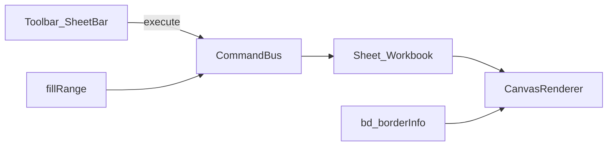

# 可用版 Phase 2 Implementation Plan

> **For agentic workers:** Inline execution in-session. Steps use checkbox syntax.

**Goal:** 补齐冻结列可视联动、填充柄序列增强、单元格边框、Sheet 增删改名。

**Architecture:** 改动仍进 `CommandBus`（可 undo）；绘制与 hit-test 在 core；Vue 只加工具栏 / SheetBar 入口。

**Tech Stack:** 现有 pnpm monorepo · `@luckysheet3/core` · `@luckysheet3/vue` · Vitest

## Global Constraints

- `packages/core` 禁止 `import vue`
- 边框用单元格 `bd`（Lucky 兼容字段），同时写入 `config.borderInfo` 便于导出
- 不做：xlsx、协同、透视、图表、完整 109 API
- 删除 Sheet 时至少保留一张；删当前表则切到相邻表

## 文件结构

```
packages/core/src/
  render/canvas-renderer.ts   # 冻结行列分带绘制 + clip；画 bd 边框
  clipboard/clipboard.ts      # 文本后缀 / 日期 / 横向序列
  model/cell.ts               # CellBorder / bd
  model/workbook.ts           # addSheet / deleteSheet / renameSheet
  command/types.ts            # setBorders / addSheet / deleteSheet / renameSheet
  command/bus.ts              # 实现上述命令
  engine.ts                   # 对外 API
packages/vue/src/components/
  Toolbar.vue                 # Border All / Outside / None
  SheetBar.vue                # + / 双击重命名 / 删除
packages/core/tests/
  freeze.spec.ts              # 增补冻结列
  clipboard.spec.ts           # 文本/日期/横向
  borders.spec.ts
  sheets.spec.ts
```



---

### Task 1: 冻结列可视联动

**问题:** `getCellRect` / hit-test 已支持 `freeze.col`，但 `CanvasRenderer` 从 `startCol = searchOffset(scrollLeft)` 起画，冻结列会随横向滚动消失；列头同理。

**做法:**
1. 计算 `fr = freeze`；始终绘制 `c ∈ [0, fr.col)` 与 `r ∈ [0, fr.row)`（scroll 对该带为 0）
2. 可滚动区：`startCol = max(fr.col, searchOffset(...))`，`startRow = max(fr.row, ...)`
3. 列头：先画冻结列（x 不减 scroll），再画滚动列；行头同理
4. 内容区用 clip 分带，避免滚动格盖住冻结格
5. 冻结线仍画在 band 边界（不减 scroll）

**测试:** `freeze.spec.ts` 增加 `frozen col ignores scrollLeft in getCellRect`（与行对称）。

---

### Task 2: 填充柄增强

扩展 `fillRange` / `detectSeries`：
- 数字：已有纵向；补**横向**等差
- 文本后缀数字：`A1,A2 → A3`（正则 `^(.*?)(\d+)$`）
- 日期：`YYYY-MM-DD`（或 `ct.t === 'd'`）按日步进；单格向下/向右 +1 天
- 无法识别则保持 tile 复制

**测试:** text suffix、date、horizontal numeric。

---

### Task 3: 边框

```ts
type BorderSide = { style: number; color: string };
type CellBorder = { t?: BorderSide; b?: BorderSide; l?: BorderSide; r?: BorderSide };
// CellData.bd?: CellBorder | null
```

命令 `setBorders { range, mode: 'all'|'outside'|'none', color?, style? }`：
- `all`：选区每格四边
- `outside`：仅外围
- `none`：清除选区 `bd`
- 同步 append/rewrite `config.borderInfo` 一条 range 记录（导出兼容）
- undo：structural `prevState` 或 `affectedCells`（含 bd）

渲染：在格子 stroke 后按 `bd` 画四边（style=1 细线，2 中粗）。

工具栏：Border / Outer / No Border。

---

### Task 4: Sheet 管理

Workbook:
- `addSheet(name?)` → 新 index（max+1）、order 末尾、切过去
- `renameSheet(index, name)`
- `deleteSheet(index)` → 不可删最后一张；若删当前则切邻表

命令 + undo（`prevSheets` 快照或 inverse add/delete/rename）。

SheetBar：`+`、双击 tab 重命名、右键或 × 删除。

Chrome：`sheet` / `change` 时刷新 `sheets` 列表。

---

### 验收

- [x] `pnpm --filter @luckysheet3/core test` 全绿（41）
- [ ] playground：Freeze Col 后横向滚动冻结列固定；拖填充文本/日期；边框按钮；Sheet +/改名/删
