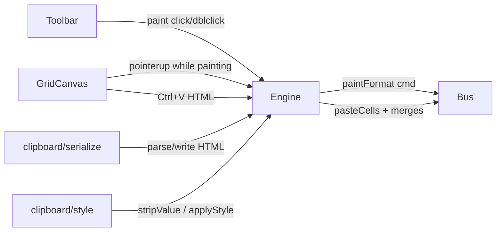

# 富粘贴与格式刷（D2）设计

- 日期：2026-09-21
- 状态：已实现（2026-09-21）
- 范围：D2 = 格式刷 + 富 HTML 粘贴（样式/边框）+ 合并格还原
- 对照：Luckysheet `selection.js`（`pasteHandler*` / `pasteHandlerOfPaintModel`）+ `menuButton.js` 格式刷

## 1. 目标

在现有内存剪贴板与 TSV/简易 HTML 粘贴之上，补齐日常「像 Excel」的两块能力：

1. **格式刷**：源选区样式刷到目标选区（不改单元格值/公式）
2. **富粘贴**：系统 HTML 尽量还原样式与边框；应用内/HTML 粘贴可还原合并格

成功标准：

- 单击格式刷刷一次后退出；双击可连续刷；Esc / 再点按钮退出
- 格式刷后目标格 `v`/`m`/`f` 不变，`bg/fc/bl/it/fs/ff/ht/vt/bd/ct` 按源矩阵平铺
- 从 Excel/本应用复制的带 `rowspan`/`colspan` 与常见 `style` 的 HTML 表，粘贴后样式与合并可见
- 应用内复制含合并区 → 粘贴到新锚点后合并块正确偏移
- 上述行为可通过 core 单测覆盖；操作可撤销

## 2. 非目标（本轮不做）

- 保护校验、粘贴选项对话框、数据验证复制
- 图片 / 图表 / 批注粘贴
- 隐藏行列语义、行高列宽随粘贴完整还原
- 多选区启动格式刷（对齐原版：禁止并忽略）
- 完整 inlineStr / 条件格式

## 3. 架构



复用现有路径（方案 A）：

- `ClipboardPayload` 扩展，不另起平行粘贴栈
- 格式刷用独立 `paintMode` 状态 + 源快照，应用时走新命令 `paintFormat`
- HTML 解析增强放在 `clipboard/serialize.ts`（或拆出 `html-table.ts` 若文件过大）
- 合并列表随粘贴载荷走，`pasteCells` 命令扩展可选 `merges`

## 4. 数据模型

### 4.1 样式字段（格式刷 / 富粘贴共用）

从 `CellData` 抽取「格式面」：

```ts
type CellFormat = Pick<
  CellData,
  "bg" | "fc" | "bl" | "it" | "fs" | "ff" | "ht" | "vt" | "bd" | "ct"
>;
```

- `stripValue(cell)`：去掉 `v`/`m`/`f`（及未来的 inline 内容），保留格式面  
- `applyFormat(target, format)`：合并格式到目标格（目标无则新建仅格式格；`null` 格式字段表示清除该字段时按「覆盖写入源快照」——源缺省字段不强制清空目标，**采用覆盖：源快照有的键写入，源为 undefined 的键不动**；若源格为 `null`，目标格式面清空但保留值）

### 4.2 合并相对描述

```ts
type RelativeMerge = {
  /** 相对粘贴矩阵左上角的偏移 */
  r: number;
  c: number;
  rs: number;
  cs: number;
};
```

### 4.3 ClipboardPayload 扩展

```ts
type ClipboardPayload = {
  cells: Array<Array<CellData | null>>;
  cut?: boolean;
  from: SelectionRange;
  merges?: RelativeMerge[]; // 相对 from 左上角
};
```

`extractRange` 之外新增 `extractMerges(sheet, range)`：收集与选区相交且**完全落在选区内**的合并块（部分相交则跳过该块，避免半截合并）。

### 4.4 格式刷状态（Workbook / Engine）

```ts
type PaintMode = {
  /** true = 刷一次后退出；false = 连续 */
  single: boolean;
  source: Array<Array<CellData | null>>; // 已 stripValue
  merges?: RelativeMerge[]; // 可选：格式刷不重建合并（D2：格式刷不粘贴合并，只刷样式/边框）
  from: SelectionRange;
};
```

- `workbook.paintMode: PaintMode | null`
- 进入格式刷：设 `copyHighlight = from`（复用蚂蚁线）
- **格式刷不创建/修改合并格**（对齐原版 paint 以样式为主；合并粘贴只走普通粘贴路径）

## 5. 命令

### 5.1 `paintFormat`

```ts
{
  type: "paintFormat";
  anchorRow: number;
  anchorCol: number;
  rowCount: number; // 目标覆盖高
  colCount: number;
  source: Array<Array<CellFormat | null>>; // 或完整 CellData 已去值
  sheetIndex?: string | number;
}
```

行为：

1. 目标为 1×1 时：`rowCount/colCount` 扩为源矩阵尺寸  
2. 否则按源高宽 tile 覆盖目标矩形  
3. 每格：`applyFormat`，保留原 `v`/`m`/`f`  
4. 撤销：恢复受影响格的完整旧 `CellData`

### 5.2 `pasteCells` 扩展

```ts
{
  type: "pasteCells";
  // ...existing
  merges?: RelativeMerge[]; // 相对 anchor 的合并
}
```

粘贴顺序：

1. （可选）`clearSource` 剪切清空  
2. 写入 cells  
3. 对每个 merge：`sheet.setMerge({ r: anchorRow+r, c: anchorCol+c, rs, cs })`  
   - `setMerge` 已会拆除重叠旧合并  

部分目标落在已有合并内部：依赖现有 `setMerge` 重叠拆除；不做弹窗。

## 6. 格式刷交互

| 操作 | 行为 |
|---|---|
| 工具栏单击 | `single=true`，进入 paint；多选区则忽略 |
| 工具栏双击 | `single=false`，连续刷 |
| 指针在网格完成一次选区（pointerup） | 若 `paintMode`：对活动选区执行 `paintFormat`；`single` 则 `cancelPaint` |
| Esc / 再点格式刷 | `cancelPaint`：清 `paintMode` + `copyHighlight` |
| Ctrl+C/X 时 | 若在 paint 中则先取消 paint（对齐原版） |

光标：网格容器加 class（如 `ls3-grid--paint`）即可，不做原版 popover。

## 7. HTML 富解析 / 写出

### 7.1 解析

对每个 `<td>`/`<th>`：

- 文本：现有 `stripTags` + `decodeHtml`
- 样式：解析 `style="..."` 与简单属性  
  - `background` / `background-color` → `bg`  
  - `color` → `fc`  
  - `font-weight: bold|≥700` → `bl=1`  
  - `font-style: italic` → `it=1`  
  - `font-size`（px/pt）→ `fs`（pt 约等于原值，px/1.33 粗转）  
  - `text-align: left|center|right` → `ht`  
  - `border` / `border-*-` 简易映射 → `bd`（能解析则写 thin `#000`，颜色可取）  
- `rowspan`/`colspan`：在逻辑网格中占位；主格写入 cell，覆盖格记为「被合并占用」不写重复值；收集 `RelativeMerge`

输出：

```ts
{ cells: CellData[][]; merges: RelativeMerge[] }
```

`parseClipboardPayload` 改为返回该结构（或并行 API `parseClipboardRich`）；`pasteFromExternal` 传入 merges。

### 7.2 写出

`cellsToHtml(cells, merges?)`：

- 主格输出样式内联（bg/fc/bl/it/fs/ht）与 border 简写  
- 合并主格写 `rowspan`/`colspan`；被覆盖格跳过不输出 `<td>`

## 8. 文件触点

| 文件 | 职责 |
|---|---|
| `clipboard/style.ts`（新） | stripValue / applyFormat / extractFormatMatrix |
| `clipboard/serialize.ts` | 富 HTML 解析与写出 + merges |
| `clipboard/clipboard.ts` | extractMerges；payload 类型 |
| `command/types.ts` + `bus.ts` | `paintFormat`；`pasteCells.merges` |
| `model/workbook.ts` | `paintMode` |
| `engine.ts` | start/cancel paint；pointer 应用；paste 带 merges |
| `GridCanvas.vue` | paint 时 pointerup；Esc；CSS class |
| `Toolbar.vue` | 格式刷按钮 click/dblclick |
| `tests/clipboard.spec.ts` + 新 `paint-format.spec.ts` | 单测 |
| `docs/FEATURE_MAP.md` | 更新 selection.js / 格式刷状态 |

## 9. 测试计划

1. `stripValue` / `applyFormat` 保留值  
2. `paintFormat` 单格扩尺寸；大区 tile；undo  
3. `extractMerges` 仅完全包含的合并  
4. `pasteCells` + merges 偏移正确  
5. HTML：`style` + `rowspan=2` 解析进格并合并  
6. `cellsToHtml` round-trip 粗测（样式键 + merge 尺寸）  
7. Engine：single paint 后 `paintMode===null`；continuous 仍在；Esc 清除  

## 10. 风险与策略

- Excel HTML 变体多：只保证常见 `style` + rowspan/colspan；解析失败降级为纯文本  
- 合并与现有选区重叠：依赖 `setMerge` 拆重叠，可能破坏目标区原合并——可接受（D2）  
- `paintFormat` 与 `setStyle` 并存：刷多样式用一条命令保证一次 undo  

## 11. 实现顺序建议

1. style 工具 + paintFormat 命令 + 格式刷 UI/状态  
2. extractMerges + pasteCells.merges + 应用内复制粘贴合并  
3. HTML 富解析/写出 + pasteFromExternal  
4. FEATURE_MAP + 回归全量测试  
